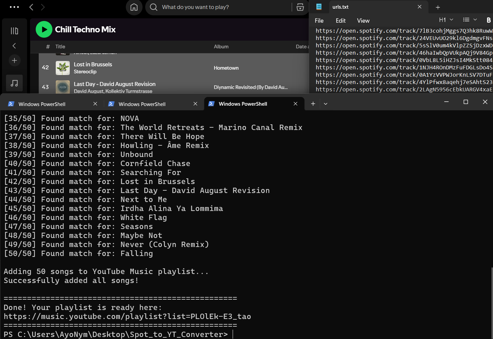
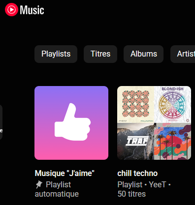

# Spotify to YouTube Music Converter

A free, local, self-hosted Python script to convert Spotify tracks into a YouTube Music playlist. No Spotify Premium required. No Google Cloud Developer account required. No 500-song limits.

## How It Works

1. The script reads Spotify track URLs from `urls.txt`.
2. It uses Spotify's public oEmbed API to get the exact song name and artist.
3. It authenticates with YouTube Music using a secure, local browser session.
4. It searches YouTube Music for the exact match.
5. It creates a private YouTube Music playlist and adds all the songs.
6. It prints a direct link to your new playlist.

## Screenshots

**1. Searching, Converting and Link (`converter.py`)**



**2. Final Result**



## Prerequisites

1. Python 3.8+ installed on your computer.
2. Google Chrome installed on your computer (required for the automated login script).

## Setup Instructions

1. **Install the required Python libraries:**
   ```bash
   pip install undetected-chromedriver requests
   ```

2. **Authenticate YouTube Music (One-time setup):**
   - Run `python auto_auth.py`
   - A special Chrome window will open to YouTube Music.
   - Click "Sign In" and log into your Google account.
   - Once you see your profile picture on YouTube Music, go back to your terminal and press `ENTER`.
   - This generates a `browser.json` file containing your login session (valid for up to 2 years).

## How to Use

1. **Add your Spotify songs:**
   - Open `urls.txt` in a text editor.
   - Paste your Spotify track URLs (one per line). 
   - *Example:* `https://open.spotify.com/track/4cOdK2wGLETKBW3PvgPWqT`

2. **Run the converter:**
   - Run `python converter.py`
   - Type a name for your new playlist when prompted (or press Enter for the default "Spotify Import").
   - The script will search for each song on YouTube Music and add them to a new private playlist.

3. **Listen:**
   - When the script finishes, it will print a direct link to your new YouTube Music playlist.

## Troubleshooting

- **Error: `SAPISID cookie not found` or `401 Unauthorized`**
  - Your YouTube Music login has expired. Simply run `python auto_auth.py` again to generate a fresh `browser.json` file.
  
- **Error: `This browser or app may not be secure`**
  - Ensure you are running the latest version of `undetected-chromedriver` (`pip install --upgrade undetected-chromedriver`).
  - Ensure all background Google Chrome processes are fully closed before running the auth script.

- **Error: `invalid session id`**
  - The Chrome window was closed before the script could extract cookies. Do not close the Chrome window manually; just log in and press ENTER in the terminal.

- **Some songs say `No YT match`**
  - YouTube Music might not have the song, or the Spotify title formatting was too unusual. You can manually search for these few songs and add them to the generated playlist.

## Disclaimer
This project is for educational purposes only. It automates browser actions to interact with YouTube Music's internal API. Use it responsibly and respect the terms of service of both Spotify and YouTube.
